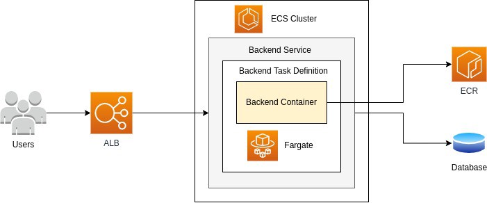
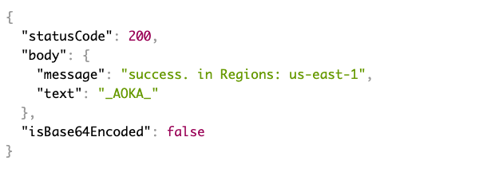

# Build your first ECS (Fargate) Application

AWS Fargate is a technology that you can use with Amazon ECS to run containers without having to manage servers or clusters of Amazon EC2 instances. With Fargate, you no longer have to provision, configure, or scale clusters of virtual machines to run containers. This removes the need to choose server types, decide when to scale your clusters, or optimize cluster packing.

This project describes the required components to build a containerized application with ECS. Please follow the below step by step instructions to create one.



### Prerequisites
  1. VS Code
  2. Node JS
  3. Docker Desktop
  4. AWS CLI
  5. AWS Account/Credentials


---

    GET YOUR APPLICATION READY!

---

### Step 1: Create a working directory

```
mkdir my-first-ecs-project
cd  my-first-ecs-project
```

### Step 2: Create a Node Js Project

`npm init -y`

### Step 3: Create an Express Server

```
npm install express -save
npm install
```
### Step 4: Create a server.js file and update it with the following

```
const express = require('express');
const app = express();
app.use(express.json());

app.listen(8080, () => {
  console.log('Server is up on 8080');
});
```

### Step 5: Start the Server
`node server.js`


http://localhost:8080/

### Step 6: Add a Healthcheck and a Get End Point

```
app.get('/', async (req, res, next) => {
  try {
    let returnjson = {
      statusCode: 200,
      headers: {
        'Content-Type': 'application/json',
        'Access-Control-Allow-Origin': '*',
      },
      body: JSON.stringify({
        text: 'Hello World!',
      }),

      isBase64Encoded: false,
    };
    res.json(returnjson);
  } catch (error) {
    return next(error);
  }
});
```

```
app.get('/healthcheck', async (req, res, next) => {
  try {
    let returnjson = {
      statusCode: 200,
      headers: {
        'Content-Type': 'application/json',
        'Access-Control-Allow-Origin': '*',
      },
      body: JSON.stringify({
        message: 'success',
        text: '_AOKA_',
      }),
      isBase64Encoded: false,
    };
    res.json(returnjson);
  } catch (error) {
    return next(error);
  }
});
```

http://localhost:8080/

http://localhost:8080/heathcheck/

---

      DOCKERIZE YOUR APPLICATION

---

### Step 1: Create the Dockerfile

```
#Change to your version of the Node
FROM node:12.22.3
WORKDIR /usr/src/app
COPY package*.json ./
RUN npm install
#Copy everything in the current folder, to the WORKDIR
COPY . .
EXPOSE 8080
CMD [ "npm", "start" ]
```

### Step 2: Now Build the Container

`docker build -t my-first-ecs-project .`

### Step 3: Generate image and access the end points via localhost

`docker run -p 8080:8080 -d my-first-ecs-project`

http://localhost:8080/

http://localhost:8080/healthcheck/

---

      CREATE AWS ECR AND PUSH THE DOCKER IMAGE OF THE APPLICATION YOU JUST CREATED

---

### Step 1: Create ECR (Elastic Container Registry)


`aws cloudformation create-stack --stack-name demo-ecr-repo --template-body file://ecr.yml --profile saml --capabilities CAPABILITY_AUTO_EXPAND`

### Step 2: Tag the Image

`docker image tag my-first-ecs-project:latest {your_account_id}.dkr.ecr.us-east-1.amazonaws.com/demo-ecr-dev-hworld:latest`

### Step 2: Get the ECR Credentials

`aws ecr get-login-password --profile saml | docker login --username AWS --password-stdin {your_account_id}.dkr.ecr.us-east-1.amazonaws.com`

This command retrieves and displays an authentication token using the GetAuthorizationToken API that you can use to authenticate to an Amazon ECR registry

### Step 3: Push the image to ECR

`docker push {your_account_id}.dkr.ecr.us-east-1.amazonaws.com/demo-ecr-dev-hworld:latest`

---

      Create LOAD BALANCER, ECS Service/Tasks

---

### Step 1: Create Load Balancer, Listener and Container/ELB Security Groups etc

`aws cloudformation create-stack --stack-name demo-elb-repo --template-body file://elb.yml --profile saml --capabilities CAPABILITY_AUTO_EXPAND`

### Step 2: Create ECS Cluster, Services and Tasks


`aws cloudformation create-stack --stack-name demo-ecs-repo --template-body file://ecs.yml --profile saml --capabilities CAPABILITY_AUTO_EXPAND`

---

      WE ARE DONE!!!

---

The end point is now accessible via

https://{hostname of the ELB}/healthcheck


